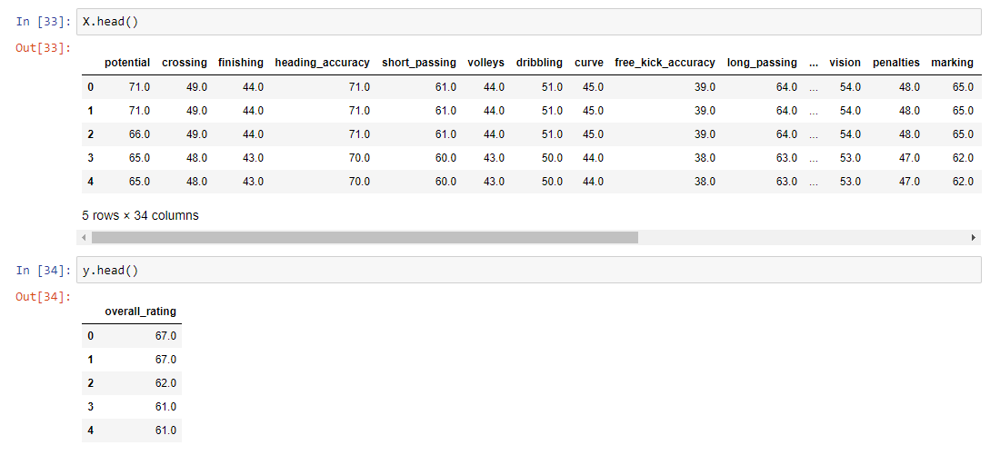
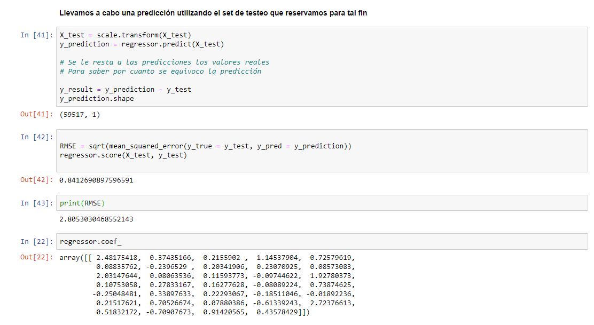

# ML - Regresion Lineal - European Futbol Players

Machine learning project with Python.

## Description

Given a 2008 dataset of the European soccer league, we seek to create a linear regression model using Machine Learning to predict the overall rating of the players.

## Used Tools

- Python
- Jupyter notebook
- Sqlite3
- Pandas
- Sklearn
- Matplotlib
- Seaborn
- Numpy

## Captures

#### Dataset:

### Results:

